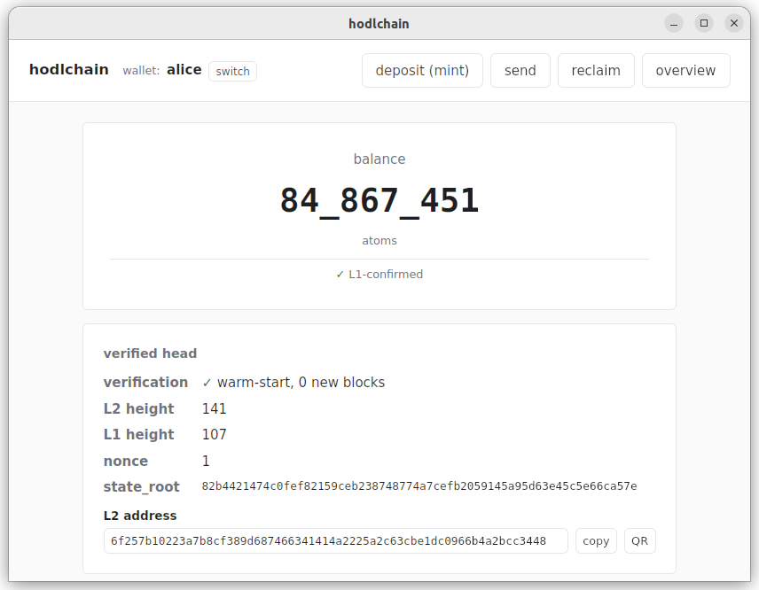
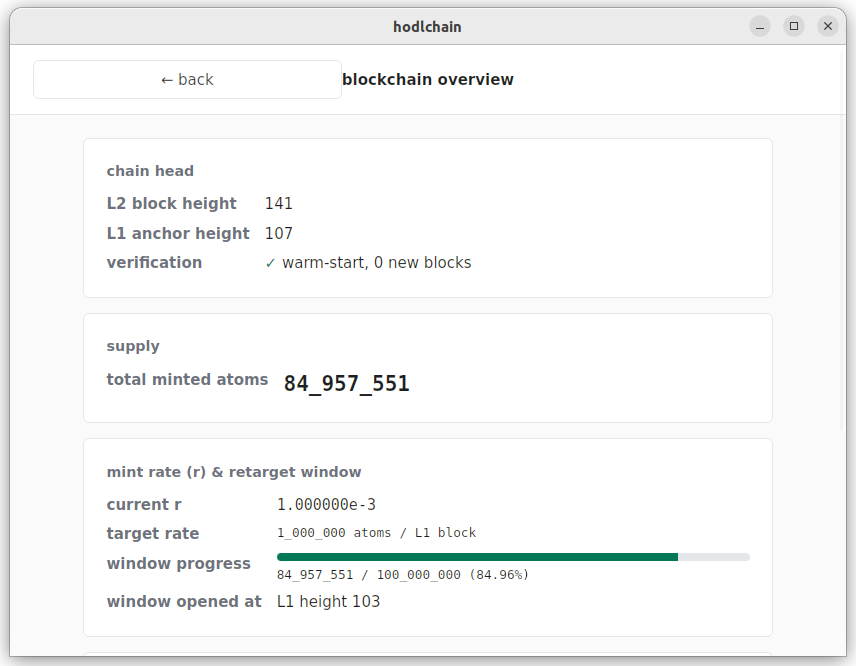

# Running the hodlchain desktop wallet on regtest

These instructions assume you're downloading pre-built release
artifacts. If you'd rather build from source, see
[`build-from-source.md`](./build-from-source.md).

The wallet is a thin client; it needs a running
**sequencer + node + bitcoind** to talk to. For local testing on
regtest, you start that with the bundled `hodl-regtest` orchestrator.
For signet (when available), you'd point the wallet at a shared VPS
URL instead — that path is regtest-only.

You need two release downloads from the
[releases page](https://github.com/AdamISZ/hodlchain/releases):

1. **`hodlchain-backend-<os>-<arch>.tar.gz`** — contains
   `hodl-regtest`, `hodl-sequencer`, `hodl-node`, `hodl-wallet`.
2. **The GUI bundle** — `hodlchain_*.AppImage` on Linux,
   `hodlchain_*.dmg` on macOS.

…plus Bitcoin Core v22+ installed (the regtest tool wraps `bitcoind`
but does **not** ship it). Detection is by `$PATH` or via
`BITCOIND_PREFIX` / `BITCOIND_BIN`.

---

## Linux

### 1. Install Bitcoin Core

Easiest path is the
[official binary release](https://bitcoincore.org/en/download/):

```bash
cd /tmp
wget https://bitcoincore.org/bin/bitcoin-core-27.0/bitcoin-27.0-x86_64-linux-gnu.tar.gz
tar xzf bitcoin-27.0-x86_64-linux-gnu.tar.gz
sudo install -m 755 bitcoin-27.0/bin/bitcoind /usr/local/bin/
sudo install -m 755 bitcoin-27.0/bin/bitcoin-cli /usr/local/bin/
```

Verify:

```bash
bitcoind --version | head -1
```

### 2. Unpack the backend binaries

Put them somewhere on your `$PATH` or remember where they are:

```bash
mkdir -p ~/hodlchain
cd ~/hodlchain
# Download and extract the backend tarball into this directory.
tar xzf hodlchain-backend-linux-x86_64.tar.gz
ls
# → hodl-regtest hodl-sequencer hodl-node hodl-wallet
```

`hodl-regtest` looks for `hodl-sequencer` and `hodl-node` adjacent
to itself first, then on `$PATH`. Keeping them in one directory is
the simplest setup.

### 3. Start the backend

```bash
cd ~/hodlchain
./hodl-regtest start
```

You should see output like:

```
[ok]  bitcoind:    /usr/local/bin/bitcoind
[ok]  hodl-sequencer: …/hodl-sequencer
[ok]  hodl-node:      …/hodl-node
[ok]  datadir: /home/you/.local/share/hodlchain/regtest
[..]  starting bitcoind (regtest)…
[ok]  bitcoind RPC ready
[..]  mining 101 blocks to user wallet (regtest maturity)…
[ok]  hodl-sequencer up on 127.0.0.1:28080
[ok]  hodl-node up on 127.0.0.1:28081

backend ready. Point the desktop wallet at:
  sequencer URL: http://127.0.0.1:28080
  node URL:      http://127.0.0.1:28081
  esplora URL:   http://127.0.0.1:28081
```

The datadir is persistent. Stop and resume at will with
`./hodl-regtest stop` and `./hodl-regtest start`; wipe with
`./hodl-regtest reset --yes` if you want a fresh chain.

### 4. Download and launch the GUI

```bash
chmod +x hodlchain_*.AppImage
./hodlchain_*.AppImage
```

(If you prefer system-package install, a `.deb` is in the same
release: `sudo dpkg -i hodlchain_*.deb`.)

### 5. Set up a wallet

On first launch you'll see the wizard. Fill in:

- **Wallet name** — any short identifier (a–z, 0–9, hyphen, underscore).
  Stored at `~/.config/hodlchain/wallets/<name>.json`.
- **Network** — `regtest`.
- **Sequencer URL** — `http://127.0.0.1:28080`.
- **Node URL** — `http://127.0.0.1:28081`.
- **Esplora URL** — `http://127.0.0.1:28081`.

Click **create wallet**, back up the 24-word phrase, then
**continue** to the dashboard:



---

## macOS

### 1. Install Bitcoin Core

```bash
brew install bitcoin
```

(Or [download from bitcoincore.org](https://bitcoincore.org/en/download/)
and put `bitcoind` + `bitcoin-cli` on `$PATH`.)

### 2. Unpack the backend binaries

```bash
mkdir -p ~/hodlchain
cd ~/hodlchain
# Replace the arch as appropriate (-aarch64 for Apple Silicon).
tar xzf hodlchain-backend-macos-aarch64.tar.gz
ls
```

### 3. Start the backend

Identical to the Linux step. The macOS datadir lives at
`~/Library/Application Support/hodlchain/regtest`.

```bash
./hodl-regtest start
```

### 4. Install + allow the GUI past Gatekeeper

Open the downloaded `hodlchain_*.dmg`, drag **hodlchain** into
`/Applications`, then:

```bash
# Release builds are not yet code-signed or notarised.
xattr -dr com.apple.quarantine /Applications/hodlchain.app
```

(Equivalent GUI path: right-click **hodlchain** → **Open** → confirm
in the dialog.)

### 5. Launch + set up a wallet

Open **hodlchain** from Spotlight or `/Applications`. Wallet fields
are the same as Linux. Wallet files live at
`~/Library/Application Support/hodlchain/wallets/<name>.json`.

---

## A complete first-run flow

After the wizard completes, the dashboard shows balance 0 (with a
`[SOFT]` pill — sequencer-acknowledged — and a subsidiary
"L1-confirmed" line just below, matching `0` while there's no
activity). The dashboard auto-refreshes every 10 seconds. To
actually try the mint loop:

1. **Click "deposit (mint)"**. Pick a short lock — try `T = 50`
   blocks for a quick demo. Click **derive deposit address**.
2. **Copy the deposit address** (use the copy button next to it).
3. **In a terminal**, fund the deposit and confirm it:
   ```bash
   ./hodl-regtest fund <paste-deposit-address> 0.1
   ./hodl-regtest mine 1
   ```
4. Back in the wallet, wait a few seconds — the funding status polls
   every 5s and should switch to **confirmed** automatically. (You
   can also click **check now** to force a poll.) Once confirmed,
   click **submit mint message**.
5. The wallet shows a `[SOFT]` pill on the result panel — the
   sequencer has acknowledged the mint and committed to including
   it at a specific L2 height. Mine more L1 blocks so the
   attestation that covers that L2 height confirms on L1:
   ```bash
   ./hodl-regtest mine 2
   ```
   The pill flips to `[L1-CONFIRMED]` automatically as the L1
   attestation catches up — no need to click refresh. On the
   dashboard the headline balance updates immediately (it's the
   soft value); the small "L1-confirmed" subsidiary line below
   it lags slightly until the attestation lands.
6. The **overview** tab has a live snapshot of the chain's `r`
   and retarget window, plus a mint calculator you can use to
   predict the result of future deposits:

   

For transfers, the **send** tab shows a live "amount / + fee /
= total" preview as you type. The chain charges a flat 0.01%
protocol fee (with a 100-atom floor) on every transfer; the fee
credits the sequencer's L2 account. The receipt panel after
submitting includes the same breakdown plus the soft → L1-confirmed
transition you saw on the mint flow.

After your lock blocks elapse you can spend the deposit back to any
L1 address from the **reclaim** tab. Use
`./hodl-regtest mine <enough-blocks>` to cross the CSV threshold.

## Soft vs. L1-confirmed: what the pills mean

The wallet distinguishes two confirmation tiers:

- **`[SOFT]`** — the sequencer has accepted your tx and signed
  a receipt promising inclusion at a specific L2 height
  (current head + 1). Visible within a second or two of submit.
  Backed by sequencer trust: if the sequencer ever signs two
  conflicting receipts for the same tx, anyone holding both can
  prove the misbehaviour against the sequencer's published
  identity pubkey.
- **`[L1-CONFIRMED]`** — the L2 block containing your tx has
  been attested to Bitcoin and the wallet has verified the
  attestation via a light walk. Backed by Bitcoin's security
  model. Takes ~1–2 L1 blocks to land after the soft-conf
  (because the sequencer's attestation tx for the L2 block
  needs to confirm on L1).

For everyday transfers the soft confirmation is what you act
on. For "this matters, wait until it's anchored" cases (large
amounts, exchange deposits), wait for the pill to flip to
L1-confirmed.

---

## Quick reference

```
./hodl-regtest start              # bring backend up
./hodl-regtest stop               # graceful shutdown (state preserved)
./hodl-regtest status             # PIDs + L1/L2 heights
./hodl-regtest mine N             # mine N L1 blocks (default 1)
./hodl-regtest fund <addr> <btc>  # send BTC from user wallet
./hodl-regtest reset --yes        # stop and wipe the datadir
./hodl-regtest logs               # tail sequencer + node logs
```

`$HODL_REGTEST_DATA` overrides the datadir location (useful if you
want to keep multiple chains around). `$BITCOIND_PREFIX` /
`$BITCOIND_BIN` / `$BITCOIN_CLI_BIN` override Bitcoin Core
discovery.

---

## Troubleshooting

- **`bitcoind not found`** — install Bitcoin Core, or set
  `BITCOIND_PREFIX=/path/to/dir/containing/both/binaries`.
- **`port 28443 (bitcoind RPC) is already in use`** — something else
  is on the regtest port. Check `ss -tlnp | grep 2844` (Linux) or
  `lsof -i :28443` (macOS) for the culprit. If it's a previous
  `hodl-regtest` that crashed without a clean `stop`, run
  `./hodl-regtest stop` to clear stale state.
- **AppImage won't run on Linux** — `chmod +x` it. If you see
  `dlopen failed: libfuse.so.2`, install libfuse 2:
  `sudo apt install libfuse2` on Ubuntu 22.04, or `libfuse2t64`
  on 24.04+ (newer Ubuntu/Debian renamed the package).
- **AppImage errors about `libwebkit2gtk-4.1.so.0` / `libgdk-3.so.0`
  / `libsoup-3.0.so.0` etc.** — the GUI depends on system webkit2gtk
  4.1. On Ubuntu 22.04 it's in `jammy-updates/universe` (enabled by
  default — `sudo apt install libwebkit2gtk-4.1-0` if missing). On
  Debian 12+, Fedora 38+, and current rolling distros the package is
  in the main repos. If you're on an older distro that only ships
  webkit2gtk-4.0, the AppImage won't run — you'd need to either build
  from source against your installed webkit or upgrade the distro.
- **GUI shows "could not start"** — the backend isn't reachable on
  the URLs you typed. Run `./hodl-regtest status`; if everything's
  stopped, `start` it.
- **Balance not updating after a mint** — the headline (soft)
  balance updates within ~30 seconds (one L2 block interval) of
  submitting the mint message. The subsidiary "L1-confirmed"
  line trails by 1–2 L1 blocks. If the soft balance never moves,
  the sequencer probably rejected the mint — check the receipt
  panel on the Mint view or run `./hodl-regtest logs` for hints.
