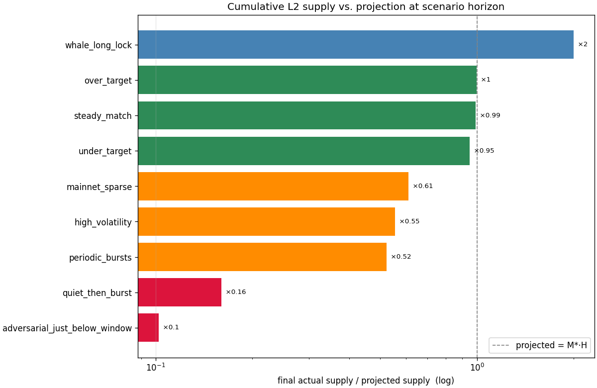

# Retargeting simulation

Explores the behaviour of the hodlchain mint function + mint-paced
retargeting algorithm under different L1 deposit patterns.

The actual minting and retargeting math lives in the Rust binary
[`hodl-simulate/`](hodl-simulate/), which calls directly into
`hodl_core::consensus::mint_fn` and faithfully re-implements
`LedgerState::end_of_block`. A unit test pins the re-implementation
against the production code on the demo constants, so the two cannot
drift silently — change either and `cargo test -p hodl-simulate`
turns red.

`run.py` is a thin Python orchestrator: it generates scenarios,
shells out to the Rust binary, and plots the resulting trace with
matplotlib. All algorithmic decisions stay in Rust; Python only
arranges inputs and renders outputs.

## What the plots show

For every scenario `run.py` produces a 4-panel figure:

1. **Mints per L1 block** — the event stream as processed (each
   mint sized by whichever `r` held at that block).
2. **Cumulative L2 supply** — actual supply vs. the steady-state
   projection `M*·H`, so over- and under-issuance are obvious by eye.
3. **Current `r`** — how the rate parameter moves as the algorithm
   retargets.
4. **Window atoms** — atoms accumulated in the open retarget window,
   with the `M_w` threshold drawn for reference.

Vertical bands on every panel mark retarget events (red = `r` shrank,
green = `r` grew).

It also emits `summary.png` — a horizontal bar chart of every
scenario's final-supply / projection ratio, log-scaled. Anything
notably far from 1× is the "did something weird happen?" signal.

A checked-in snapshot of the current results lives in [`out/`](out/);
re-running `run.py` overwrites these files. The cross-scenario
summary:



Notable individual scenarios:

- [`out/whale_long_lock.png`](out/whale_long_lock.png) — a single
  100-BTC long-locked mint produces 2× the horizon's projected
  supply in one block.
- [`out/adversarial_just_below_window.png`](out/adversarial_just_below_window.png)
  — engineered pacing that brings cumulative supply to 10 % of
  projection by ratcheting `r` down on every window completion.
- [`out/high_volatility.png`](out/high_volatility.png) — random
  bursts ratchet `r` down ~5× over the horizon; supply lands at
  ~55 % of projection. Illustrates the asymmetric-feedback bias
  (shrinks fire immediately on bursts; grows require a full window
  to fill at low rate).

## Running it

```bash
# First time: install Python deps.
python -m venv sim/.venv && source sim/.venv/bin/activate
pip install -r sim/requirements.txt

# Run all scenarios. Output goes to sim/out/.
python sim/run.py

# Or run a subset by name:
python sim/run.py quiet_then_burst whale_long_lock
```

`run.py` will `cargo build -p hodl-simulate --release` on its first
call, then invoke the binary directly per scenario.

## Adding a scenario

Edit [`scenarios.py`](scenarios.py). A scenario is just a dict
shaped like:

```python
{
  "params": {
    "initial_r": 0.001,
    "target_atoms_per_block": 1_000_000,
    "retarget_window_atoms": 100_000_000,
    "retarget_max_factor": 2.0,
  },
  "horizon_l1_blocks": 2000,
  "events": [
    {"l1_height": 1, "value_sat": 100_000_000, "lock_blocks": 1000},
    ...
  ],
}
```

Write a generator function that returns `(name, scenario_dict)` and
append its call to the `SCENARIOS` list at the bottom of the file.

`DEMO_PARAMS` and `MAINNET_PARAMS` at the top of `scenarios.py` mirror
the two parameter sets in `crates/hodl-core/src/consensus.rs`; use
them rather than hard-coding numbers so the file stays in sync when
those constants change.

## Validating against `hodl-core`

```bash
cargo test -p hodl-simulate
```

The `matches_ledger_state_end_of_block` test drives `LedgerState`
(production code) through the same event stream as the simulator
(re-implemented math) and asserts both produce the same final `r`
and cumulative supply. If you change either side, this test catches
drift.

## Direct invocation of the Rust binary

If you'd rather skip Python:

```bash
cargo build -p hodl-simulate --release
echo '{
  "params": {"initial_r": 0.001, "target_atoms_per_block": 1000000,
             "retarget_window_atoms": 100000000, "retarget_max_factor": 2.0},
  "horizon_l1_blocks": 500,
  "events": [{"l1_height": 100, "value_sat": 500000000, "lock_blocks": 5000}]
}' | ./target/release/hodl-simulate | jq .
```
